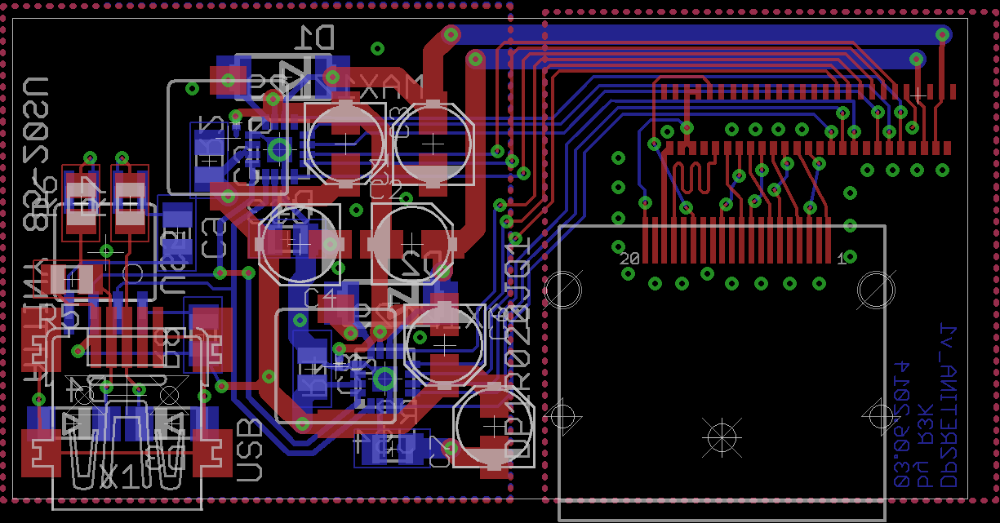

# dp2retina

Nach [diesem Blogpost](http://emerythacks.blogspot.de/2013/04/connecting-ipad-retina-lcd-to-pc.html) und Displaydatenblatt gebaut: Ein passiver Adapter von Displayport auf embedded Displayport.
Zusätzlich: zwei MAX17129 für die 12 Kanäle der Hintergrundbeleuchtung + ein ATTiny45 mit VUSB-Support für HintergrundbeleuchtungsPWM.

## Projektstatus
Das Platinenlayout funktioniert. Der Connector für das Display ist nicht schön zu löten und die Schaltreglerkomponenten mittels Lötkolben auch nicht so.

## Todo
* größere Platine
 * seitliche Anschlüsse
 * Buttons zur Helligkeitsregelung
* ein Gehäuse
 * 3D-Druck ist zu klein -> Lasercutter&Plexiglas?

## Layout und so

### Schaltplan

### Layout

